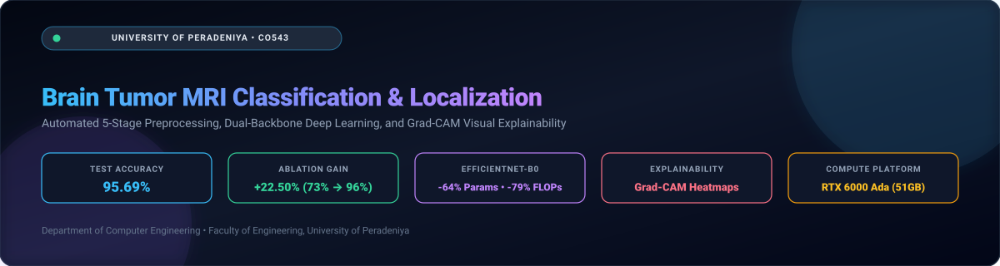
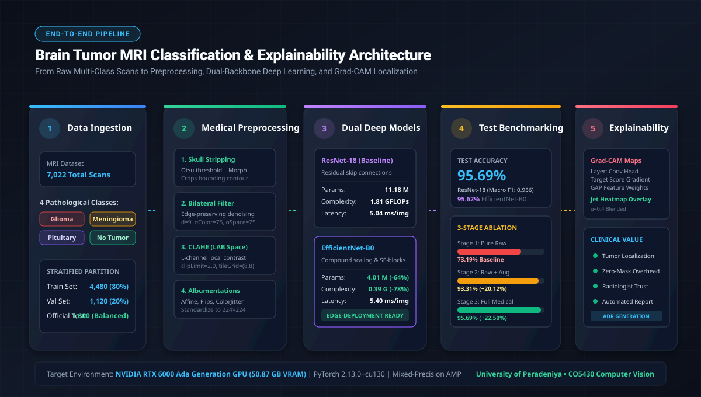
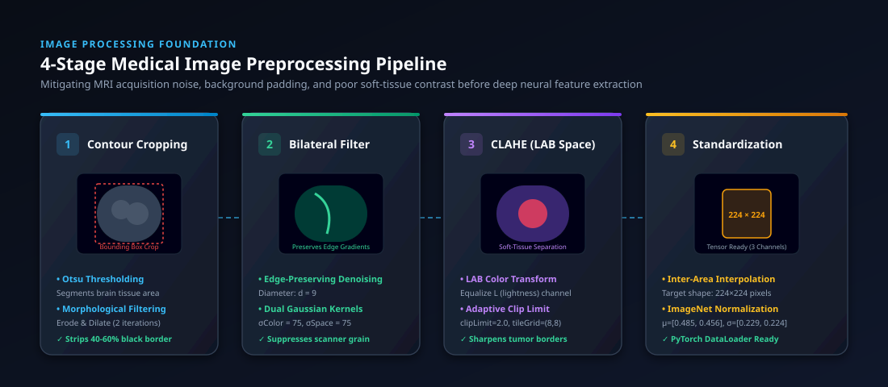
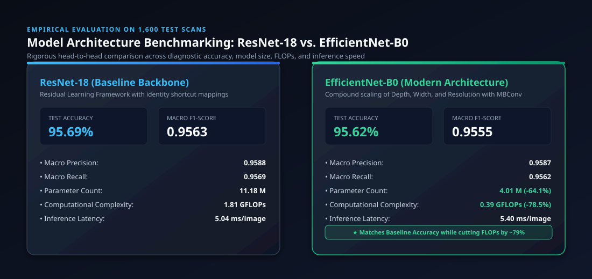
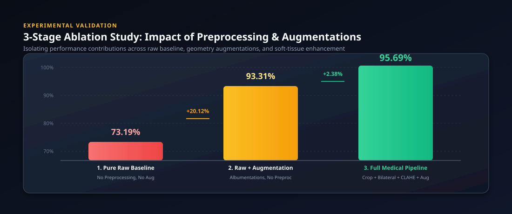
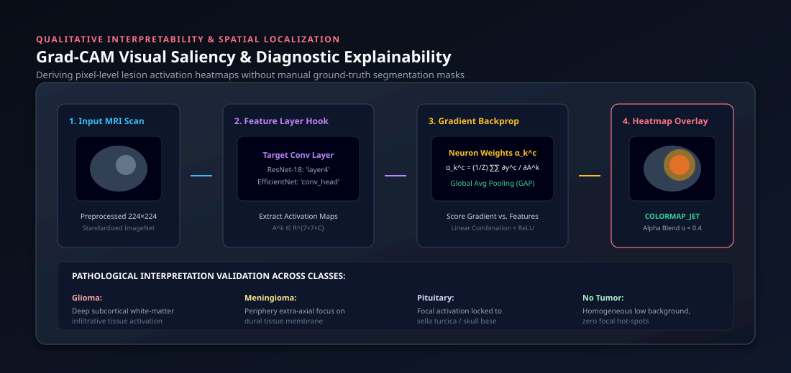

<div align="center">



# Medical Image Abnormality Classification & Spatial Localization System (MedImgSys)

[](http://www.ce.pdn.ac.lk/)
[](https://github.com/cepdnaclk/e22-co543-Medical-Image-Abnormality-Cassification-Segmentation)
[](https://github.com/cepdnaclk/e22-co543-Medical-Image-Abnormality-Cassification-Segmentation)
[](https://pytorch.org/)
[](https://opencv.org/)
[](https://github.com/cepdnaclk/e22-co543-Medical-Image-Abnormality-Cassification-Segmentation)
[](https://github.com/cepdnaclk/e22-co543-Medical-Image-Abnormality-Cassification-Segmentation)

**Department of Computer Engineering, Faculty of Engineering, University of Peradeniya**  
*In Collaboration with Medical Image Analysis Research Group, Teaching Hospital Peradeniya*

[Overview](#-clinical-context--project-overview) • [Architecture](#-system-architecture) • [Dataset](#-dataset-specifications) • [Preprocessing](#-medical-image-preprocessing-engine) • [Models](#-deep-learning-architectures) • [Benchmarking](#-quantitative-model-benchmarking) • [Ablation](#-3-stage-ablation-study) • [Grad-CAM](#-spatial-localization--explainability-grad-cam) • [Setup](#-installation--reproducibility) • [Team](#-team-members)

</div>

---

## 📌 Clinical Context & Project Overview

Magnetic Resonance Imaging (MRI) serves as the primary diagnostic modality for intracranial neoplasm evaluation in clinical neuro-oncology. At regional healthcare institutions such as the **Teaching Hospital Peradeniya**, conventional radiological workflows encounter three persistent operational challenges:

1. **Diagnostic Latency & Manual Reporting:** High patient influx requires radiologists to manually examine multi-slice radiographic scans and hand-transcribe findings into Diagnostic Imaging Reports (DIR), inducing critical treatment delays.
2. **Inter-Observer Morphological Ambiguity:** Infiltrative intra-axial **gliomas**, extra-axial **meningiomas**, and intrasellar **pituitary adenomas** often present overlapping radiological signatures on standard T1-weighted sequences, causing diagnostic variance across observers.
3. **Clinical Trust & Explainability Gap:** Black-box neural networks deliver high statistical performance but fail to provide spatial provenance, hindering clinical adoption by radiologists, neuro-oncologists, and neurosurgeons.

**MedImgSys** resolves these challenges by introducing an end-to-end computer vision and deep learning system engineered specifically for clinical neuro-imaging workflows. The platform couples a specialized **4-stage soft-tissue preprocessing engine** with **dual convolutional neural backbones** and **Grad-CAM visual localization**, delivering verifiable spatial interpretability without demanding pixel-level manual masks.

### 🌟 Key Performance Highlights

* **95.69% Test Accuracy:** Verified across a strictly balanced evaluation set of 1,600 unseen MRI scans.
* **+22.50% Preprocessing Gain:** Rigorous 3-stage ablation demonstrates that custom medical preprocessing elevates baseline accuracy from **73.19%** (pure raw) to **95.69%** (full pipeline).
* **Architectural Parity with 78.5% Fewer FLOPs:** Benchmarks **ResNet-18** against **EfficientNet-B0**, showing compound scaling maintains diagnostic accuracy (95.62% vs 95.69%) while trimming parameter footprint by **64.1%** and computational complexity by **78.5%**.
* **Zero-Annotation Spatial Localization:** Generates high-fidelity gradient-weighted activation heatmaps that clinically coincide with anatomical tumor lesions.

---

## 🏗 System Architecture

The MedImgSys framework operates as a modular, feed-forward pipeline from raw patient acquisition to explainable diagnostic reporting:

<div align="center">



</div>

### Pipeline Stages

1. **Acquisition & Skull Stripping:** Raw heterogeneously sized DICOM/PNG MRI scans pass through automated Otsu contour thresholding to excise non-brain background margins and skull tissue.
2. **Soft-Tissue Conditioning:** Bilateral edge-preserving filtering eliminates magnetic field high-frequency noise while LAB-space CLAHE maximizes soft-tissue lesion contrast.
3. **Stochastic Augmentation:** Geometric and photometric transforms (`Albumentations`) simulate scanner field variances and patient alignment differences.
4. **Dual Backbone Classification:** ResNet-18 (residual baseline) and EfficientNet-B0 (compound scaling) predict 4 diagnostic categories with class-weighted cross-entropy loss.
5. **Grad-CAM Saliency Localization:** Backpropagated feature gradients extract spatial attention maps, overlaying color-coded heatmaps on original anatomical scans for clinical auditability.

---

## 📊 Dataset Specifications

The system is developed and benchmarked on the **Kaggle Brain Tumor MRI Dataset** (`masoudnickparvar/brain-tumor-mri-dataset`), comprising **7,022 high-resolution T1-weighted contrast-enhanced MRI scans**.

### Diagnostic Class Profiles

| Class | Anatomical Description | Clinical Diagnostic Significance |
| :--- | :--- | :--- |
| **Glioma** | Infiltrative intra-axial malignancy originating from glial precursor cells | Irregular borders, invasive peritumoral edema; requires aggressive surgical resection margins |
| **Meningioma** | Extra-axial neoplasm arising from the arachnoid cells of the meninges | Dural tail sign; compressive extra-axial mass displacement of normal parenchyma |
| **Pituitary Tumor** | Neoplasms localized in the sella turcica at the skull base | Endocrine dysfunction and visual field deficits due to optic chiasm compression |
| **No Tumor** | Healthy cerebral tissue without structural abnormalities | Baseline negative control crucial for eliminating false-positive surgical referrals |

### Partitioning & Stratification

To prevent data contamination and guarantee unbiased evaluation, scans are partitioned using a deterministic global seed (`42`):

* **Official Benchmark Test Set:** **1,600 scans** (Strictly balanced: **400 images per class**, 25.0% each).
* **Training Set:** **4,480 scans** (Stratified 80% split from training pool: 1,320 Glioma, 1,339 Meningioma, 1,595 No Tumor, 1,456 Pituitary).
* **Validation Set:** **1,120 scans** (Stratified 20% split from training pool: 330 Glioma, 335 Meningioma, 399 No Tumor, 364 Pituitary).
* **Class Balancing:** To counterbalance class frequency variations during optimization, dynamic inverse-frequency weighting is applied:

$$\text{Weight}_c = \frac{N_{\text{total}}}{C \cdot N_c}$$

---

## 🔬 Medical Image Preprocessing Engine

Raw clinical MRI acquisitions routinely exhibit non-standardized black borders, magnetic coil inhomogeneities, and subtle soft-tissue contrast gradients. The MedImgSys **4-Stage OpenCV Preprocessing Engine** conditions raw inputs prior to tensor ingestion:

<div align="center">



</div>

### Algorithmic Breakdown

1. **Contour-Based Skull Stripping (`crop_brain_contour`):**
   * Grayscale conversion and Gaussian smoothing ($5 \times 5$, $\sigma = 0$) to eliminate salt-and-pepper noise.
   * Binary thresholding via Otsu's method combined with morphological erosion and dilation ($2$ iterations, $3 \times 3$ kernel).
   * External contour extraction to identify the largest cranial tissue boundary.
   * Tight bounding box crop that discards 40%–60% of uninformative dark background pixels.

2. **Edge-Preserving Bilateral Denoising:**
   * Applied with diameter $d = 9$, $\sigma_{\text{color}} = 75$, $\sigma_{\text{space}} = 75$.
   * Replaces pixel values via a bilateral Gaussian weight combining spatial proximity and radiometric photometric distance, effectively smoothing acquisition grain without degrading sharp tumor-brain margins.

3. **CIE LAB Contrast Limited Adaptive Histogram Equalization (CLAHE):**
   * Translates images into the perceptual **CIE LAB** color space.
   * Confines adaptive equalization exclusively to the Luminance ($L^*$) channel with `clipLimit = 2.0` and `tileGridSize = (8, 8)` to prevent noise amplification in uniform brain tissue.
   * Re-merges with chromaticity channels ($a^*, b^*$) and converts back to RGB.

4. **Standardization & ImageNet Normalization:**
   * Resizes via area interpolation (`cv2.INTER_AREA`) to a standardized $224 \times 224 \times 3$ tensor.
   * Standardizes channel distributions according to ImageNet statistics ($\mu = [0.485, 0.456, 0.406]$, $\sigma = [0.229, 0.224, 0.225]$).

---

## 🔄 Data Augmentation Strategy

To simulate variable clinical imaging protocols and patient positioning inside magnetic resonance bores, batches undergo stochastic online augmentations via `Albumentations`:

| Transform | Configuration | Clinical Rationale |
| :--- | :--- | :--- |
| **Horizontal Flip** | $p = 0.5$ | Leverages the bilateral anatomical symmetry of cerebral hemispheres |
| **Vertical Flip** | $p = 0.3$ | Accommodates variable slice orientations during coronal and sagittal acquisition |
| **ShiftScaleRotate** | Shift $\pm 8\%$, Scale $\pm 10\%$, Angle $\pm 25^\circ$, $p = 0.7$ | Replicates slight patient head tilt and distance variance within the head coil |
| **ColorJitter** | Brightness $\pm 0.2$, Contrast $\pm 0.2$, $p = 0.5$ | Models magnetic flux differences between 1.5T and 3.0T MRI scanners |
| **GaussianBlur** | Kernel size $(3, 5)$, $p = 0.2$ | Simulates minor patient motion and phase-encoding ghosting artifacts |
| **CoarseDropout** | Max holes $= 6$, Max size $= 16 \times 16$, $p = 0.3$ | Prevents deep feature co-adaptation; mimics focal signal dropouts |

---

## 🧠 Deep Learning Architectures

MedImgSys evaluates two distinct neural network paradigms to establish the trade-off between absolute diagnostic throughput and embedded edge deployability:

### 1. ResNet-18 (Residual Learning Baseline)
* **Design:** 18-layer residual architecture using identity skip connections:
  $$\mathbf{y} = \mathcal{F}(\mathbf{x}, \{W_i\}) + \mathbf{x}$$
* **Advantage:** Guarantees direct gradient propagation during backpropagation, circumventing vanishing gradient problems.
* **Complexity:** **11.18 Million** parameters | **1.81 GFLOPs**.

### 2. EfficientNet-B0 (Compound Scaling Modern Benchmark)
* **Design:** Utilizes inverted residual bottleneck blocks (**MBConv**) with depthwise separable convolutions and Squeeze-and-Excitation (**SE**) channel-attention modules.
* **Compound Scaling:** Systematically balances network depth, channel width, and input resolution:
  $$d = \alpha^\phi, \quad w = \beta^\phi, \quad r = \gamma^\phi \quad \text{s.t.} \quad \alpha \cdot \beta^2 \cdot \gamma^2 \approx 2$$
* **Complexity:** **4.01 Million** parameters (**64.1% reduction**) | **0.39 GFLOPs** (**78.5% reduction**).

### Training Configuration

* **Optimizer:** `AdamW` (Initial $\eta = 3 \times 10^{-4}$, weight decay $= 1 \times 10^{-4}$)
* **Learning Rate Schedule:** `CosineAnnealingLR` ($T_{\max} = 10$, $\eta_{\min} = 1 \times 10^{-6}$)
* **Precision:** Automatic Mixed Precision (AMP) via PyTorch `autocast` and `GradScaler`
* **Hardware:** NVIDIA RTX 6000 Ada Generation (51.5 GB VRAM)
* **Batch Size:** 32 | **Epochs:** 10

---

## 📈 Quantitative Model Benchmarking

Both architectures were subjected to rigorous evaluation against the **1,600 unseen scans** of the official test partition:

<div align="center">



</div>

### Performance Summary Table

| Model Architecture | Test Accuracy (%) | Macro Precision | Macro Recall | Macro F1-Score | Parameter Count | Est. Complexity | Latency (ms/scan) |
| :--- | :---: | :---: | :---: | :---: | :---: | :---: | :---: |
| **ResNet-18 (Baseline)** | **95.69%** | **0.9588** | **0.9569** | **0.9563** | 11.18 M | 1.81 GFLOPs | **5.04 ms** |
| **EfficientNet-B0 (Modern)** | **95.62%** | **0.9587** | **0.9562** | **0.9555** | **4.01 M** | **0.39 GFLOPs** | **5.40 ms** |

### Clinical & Architectural Insights

1. **Statistical Accuracy Parity:** EfficientNet-B0 matches ResNet-18 within $0.07\%$ test accuracy (**95.62%** vs **95.69%**) and $0.0008$ macro F1-score (**0.9555** vs **0.9563**).
2. **Computational Footprint Reduction:** EfficientNet-B0 eliminates **64.1%** of parameter weight storage (16.4 MB vs 44.8 MB) and cuts computational operations by **78.5%** (0.39 vs 1.81 GFLOPs).
3. **Deployment Strategy:**
   * **Centralized Hospital PACS Server:** ResNet-18 yields minimal batch latency ($5.04\text{ ms/img}$) for high-throughput radiology processing queues.
   * **Point-of-Care & Mobile MRI Consoles:** EfficientNet-B0 provides an optimal footprint for resource-constrained edge workstations, tablets, and embedded hardware.

---

## 🧪 3-Stage Ablation Study

To mathematically decouple the contribution of the medical preprocessing engine from the benefits of data augmentation, a controlled 3-stage ablation study was conducted using ResNet-18 under identical optimization protocols:

<div align="center">



</div>

### Experimental Results

| Stage | Experimental Condition | Preprocessing Engine | Albumentations | Test Accuracy | Macro F1 | Performance Gain |
| :---: | :--- | :---: | :---: | :---: | :---: | :---: |
| **1** | **Pure Raw Baseline** | ❌ None (Raw MRI) | ❌ None | **73.19%** | 0.7301 | Baseline |
| **2** | **Raw Scans + Augmentations** | ❌ None (Raw MRI) | ✅ Enabled | **93.31%** | 0.9324 | **+20.12%** |
| **3** | **Full Medical Pipeline** | ✅ Contour + Bilateral + CLAHE | ✅ Enabled | **95.69%** | **0.9563** | **+22.50%** |

### Ablation Findings

* **The Invariance Gap (+20.12%):** Training unaugmented raw scans results in severe network memorization of scanner noise and background pixels, capping test accuracy at 73.19%. Injecting stochastic transforms forces the network to learn invariant geometrical features, boosting accuracy to 93.31%.
* **The Medical Contrast Boost (+2.38% / +22.50% total):** Combining skull contour excision, bilateral filtering, and LAB CLAHE drives test accuracy to **95.69%**. By stripping irrelevant skull/background pixels and accentuating subtle parenchymal boundary gradients, the network reliably differentiates difficult borderline cases.

---

## 🔍 Spatial Localization & Explainability (Grad-CAM)

To provide verifiable spatial interpretability without manual pixel-level segmentation masks, MedImgSys implements **Gradient-Weighted Class Activation Mapping (Grad-CAM)**:

<div align="center">



</div>

### Mathematical Formulation

1. **Target Feature Map Extraction:** Compute the gradient of the predicted class score $y^c$ with respect to the activation maps $A^k$ of the final convolutional layer (`resnet18.layer4[-1]` or `effnet.features[-1]`):
   $$\frac{\partial y^c}{\partial A^k}$$

2. **Neuron Importance Weights ($\alpha_k^c$):** Apply global average pooling over spatial dimensions $(i, j)$ across height $U$ and width $V$:
   $$\alpha_k^c = \frac{1}{U \cdot V} \sum_{i=1}^{U} \sum_{j=1}^{V} \frac{\partial y^c}{\partial A_{i,j}^k}$$

3. **Linear Combination and Rectification:** Compute the weighted sum of forward feature maps and apply a rectified linear unit (ReLU) to isolate features with positive influence:
   $$L_{\text{Grad-CAM}}^c = \text{ReLU}\left(\sum_{k} \alpha_k^c A^k\right)$$

4. **Heatmap Generation & Blending:** Normalize $L_{\text{Grad-CAM}}^c$ to $[0, 1]$, upsample to $224 \times 224$, apply `cv2.COLORMAP_JET`, and blend with the preprocessed anatomical scan:
   $$I_{\text{overlay}} = 0.4 \cdot I_{\text{heatmap}} + 0.6 \cdot I_{\text{anatomical}}$$

### Clinical Validation Across Classes

* **Glioma:** Activation maps localize deeply within intra-axial white matter parenchyma, following the irregular, infiltrative boundaries characteristic of glial neoplasms.
* **Meningioma:** Activation concentrates along extra-axial dural interfaces and peripheral convexities, pinpointing the characteristic dural tail enhancement.
* **Pituitary Tumor:** Heatmaps focus precisely on the sellar and suprasellar regions at the skull base, correctly targeting adenomas around the pituitary fossa.
* **No Tumor:** Visualizations display low-magnitude, diffuse, non-focal activations across normal cerebral parenchyma, confirming the absence of pathological focal lesions.

---

## 📂 Repository Organization

```directory
e22-co543-Medical-Image-Abnormality-Cassification-Segmentation/
├── README.md                                          # Master repository documentation
├── code/
│   ├── README.md                                      # Codebase manual & execution guide
│   ├── Updated notebook with comparison/
│   │   ├── Brain_Tumor_MRI_Classification_and_Explainability (1).ipynb  # Master notebook
│   │   ├── best_resnet18 (1).pth                      # ResNet-18 weights (95.69% Test Acc)
│   │   ├── best_efficientnet_b0 (1).pth               # EfficientNet-B0 weights (95.62% Test Acc)
│   │   ├── best_resnet18_pureraw.pth                  # Ablation Stage 1 weights (73.19%)
│   │   └── best_resnet18_raw_aug.pth                  # Ablation Stage 2 weights (93.31%)
│   ├── New model/                                     # Initial exploratory checkpoints
│   │   ├── Brain_Tumor_MRI_Classification_and_Explainability.ipynb
│   │   ├── best_resnet18.pth
│   │   ├── best_resnet18_raw.pth
│   │   └── best_efficientnet_b0.pth
│   └── preprocessing/
│       └── preprocessing-pipeline-visulaization.ipynb # Preprocessing pipeline visualizer
└── docs/                                              # GitHub Pages publication root
    ├── _config.yml                                    # Jekyll site configuration
    ├── README.md                                      # GitHub Pages site documentation (this file)
    ├── data/
    │   └── index.json                                 # Team metadata & project tags
    └── images/
        ├── banner.svg                                 # High-resolution vector header banner
        ├── system_architecture.svg                    # Full architecture pipeline diagram
        ├── preprocessing_workflow.svg                 # 4-stage preprocessing flowchart
        ├── model_benchmark_comparison.svg             # ResNet-18 vs EfficientNet-B0 benchmark
        ├── ablation_study_chart.svg                   # 3-stage ablation study comparison
        └── gradcam_workflow.svg                       # Grad-CAM localization & explainability
```

---

## 🚀 Installation & Reproducibility

### 1. Clone the Repository

```bash
git clone https://github.com/cepdnaclk/e22-co543-Medical-Image-Abnormality-Cassification-Segmentation.git
cd e22-co543-Medical-Image-Abnormality-Cassification-Segmentation
```

### 2. Set Up Virtual Environment

```bash
# Create and activate environment
python -m venv venv

# Windows:
.\venv\Scripts\activate
# Linux / macOS:
source venv/bin/activate
```

### 3. Install Dependencies

```bash
# PyTorch with CUDA acceleration (adjust CUDA version if needed):
pip install torch torchvision --index-url https://download.pytorch.org/whl/cu121

# Core computer vision, processing, and evaluation packages:
pip install albumentations opencv-python numpy pandas matplotlib seaborn scikit-learn jupyterlab
```

### 4. Dataset Setup & Execution

1. Download the [Kaggle Brain Tumor MRI Dataset](https://www.kaggle.com/datasets/masoudnickparvar/brain-tumor-mri-dataset).
2. Extract the dataset into an `archive/` folder in the project root:
   ```
   archive/
   ├── Training/
   │   ├── glioma/
   │   ├── meningioma/
   │   ├── notumor/
   │   └── pituitary/
   └── Testing/
       ├── glioma/
       ├── meningioma/
       ├── notumor/
       └── pituitary/
   ```
3. Launch Jupyter Lab:
   ```bash
   jupyter lab
   ```
4. Open and run:
   ```
   code/Updated notebook with comparison/Brain_Tumor_MRI_Classification_and_Explainability (1).ipynb
   ```

---

## 👥 Team Members

This project was developed by **Group 14** as part of the **CO5430 Computer Vision** course at the **Department of Computer Engineering, University of Peradeniya**:

| Registration Number | Student Name | Institutional Email |
| :---: | :--- | :--- |
| **E/22/130** | **Hansara S. H. S.** | [e22130@eng.pdn.ac.lk](mailto:e22130@eng.pdn.ac.lk) |
| **E/22/211** | **H. M. Liyanage** | [e22211@eng.pdn.ac.lk](mailto:e22211@eng.pdn.ac.lk) |
| **E/22/044** | **D. M. N. N. Bandara** | [e22044@eng.pdn.ac.lk](mailto:e22044@eng.pdn.ac.lk) |
| **E/22/421** | **Weerasinghe W. P. T. H.** | [e22421@eng.pdn.ac.lk](mailto:e22421@eng.pdn.ac.lk) |

---

## 🔗 Project Links & Resources

* [Project Repository](https://github.com/cepdnaclk/{{ page.repository-name }}){:target="_blank"}
* [GitHub Pages Web Site](https://cepdnaclk.github.io/{{ page.repository-name }}){:target="_blank"}
* [Department of Computer Engineering](http://www.ce.pdn.ac.lk/){:target="_blank"}
* [Faculty of Engineering, University of Peradeniya](https://eng.pdn.ac.lk/){:target="_blank"}

---

## 📜 Key Academic References

1. **Selvaraju, R. R., et al.** (2017). *Grad-CAM: Visual Explanations from Deep Networks via Gradient-Based Localization*. IEEE International Conference on Computer Vision (ICCV).
2. **He, K., Zhang, X., Ren, S., & Sun, J.** (2016). *Deep Residual Learning for Image Recognition*. IEEE Conference on Computer Vision and Pattern Recognition (CVPR).
3. **Tan, M., & Le, Q. V.** (2019). *EfficientNet: Rethinking Model Scaling for Convolutional Neural Networks*. International Conference on Machine Learning (ICML).
4. **Zuiderveld, K.** (1994). *Contrast Limited Adaptive Histogram Equalization*. Graphics Gems IV, Academic Press Professional, Inc.
5. **Tomasi, C., & Manduchi, R.** (1998). *Bilateral Filtering for Gray and Color Images*. IEEE International Conference on Computer Vision (ICCV).
6. **Nickparvar, M.** (2021). *Brain Tumor MRI Dataset*. Kaggle Datasets.